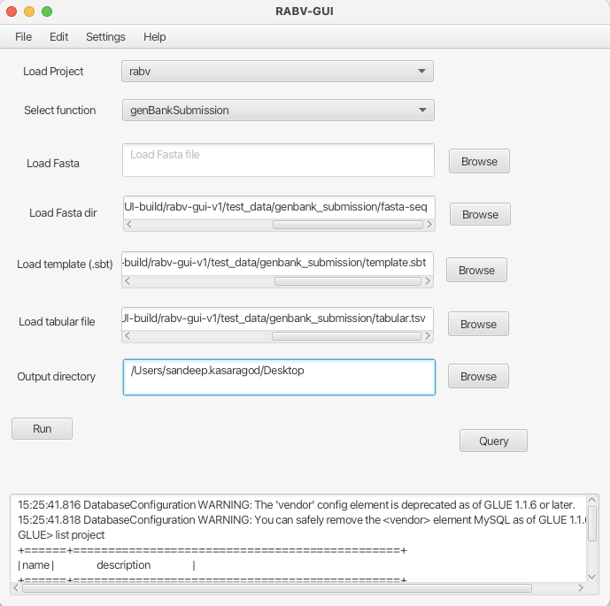

HTML: <a href="https://joss.theoj.org/papers/574ad073d9699296ae0f4db05bfb207f"></a>
Markdown: [](https://joss.theoj.org/papers/574ad073d9699296ae0f4db05bfb207f)

# Overview
RABV-GUI is a graphical user interface designed for running RABV-GLUE, specifically to facilitate GenBank submissions for rabies sequences. In addition to supporting GenBank submissions, RABV-GUI has been updated with the latest rabies sequences and can perform database queries similar to those available on the RABV-GLUE website (http://rabv-glue.cvr.gla.ac.uk/).

# Installation
RABV-GUI is developed in Java, so having Java installed is essential. We recommend using Conda to run RABV-GUI, which makes the installation process simple. For ease of installation, the install.sh script performs the following tasks:
- Install curl if it does not exist
- Install Conda/miniforge if it does not exist
- Create an environment gluetools (which contains RAxML, BLAST, MAFFT, TBLASTN)
- Create an environment RABV-GUI (which contains Java)
- Download the JavaFX SDK depending on the OS and architecture

## MySQL installation on Mac OS
Select the appropriate version of the MySQL Community Server according to your operating system. Gluetools recommends MySQL Community Server 8.0.39, which can be found at the link below. 

```shell
https://dev.mysql.com/downloads/mysql/
```
Setup the mySQL with appropriate root user and credentials for the error free post setups.

## MySQL installation on Linux (Ubuntu OS)
Run the below commands one-by-one.

```shell
sudo apt update
sudo apt install mysql-server
sudo systemctl start mysql.service
```

Run mySQL when the installation is complete.
```shell
sudo mysql
```

Your terminal should look something like this


Run the below command and exit from mySQL. Presently the root password is set to root@123. Feel free to change it. 
```shell
ALTER USER 'root'@'localhost' IDENTIFIED WITH mysql_native_password BY 'root@123';
exit
```
<b>Note</b>: The tool also creates the mysql user 'gluetools' with password 'Password123#@!'. It is highly not recommended to change password, otherwise the program may not work.

Securly store MySQL login credentials without exposing the password in plain text. This will enable the tool to access mySQL and glue_tools database without credentials.

```shell
 mysql_config_editor set --login-path=local --host=localhost --user=root --password
```
## Download and setup the environments

Download RABV-GUI from [SOURCEFORGE](https://sourceforge.net/projects/rabv-gui/files/rabv-gui-v1.zip/download) or from [Google Drive](https://drive.google.com/file/d/1aKLgeOuBSauspwPNWI3ffvrWKYHKqGeI/view?usp=sharing)
```shell
unzip RABV-GUI-v1.zip
cd RABV-GUI-v1
bash install.sh
```

### Launching the GUI
```shell
bash RABV-GUI.sh
```

The successful installation will launch the RABV-GUI. 

### Initial setups for GUI

The first time GUI launch will require few things to be setup such as path of the gluetools jar file and its configuration files.

#### Setting up the glue and path
goto-->settings-->Set glue and DB --> browse the gluetools jar, configuration and DB files from glue_jar_file directory. Refer below image for better understanding.


#### Importing SQL data
goto-->settings-->Import SQL. This will load the SQL file to the local mySQL system.

#### Load DB
This step is essential, whenever you want to perform any analysis, the DB needs to be loaded.

## Running the analysis
At this moment, RABV-GUI provides two functions. 
- maxLikeHoodGenotyper
- genBankSubmission

maxLikeHoodGenotyper requires rabies fasta file to tell which alignment/clade the sequence belongs. The image below shows running the maxLikeHoodGenotyper


genBankSubmission function, generates the GenBank sequence submission files (*.SQN). It uses the latest table2asn tool to generate the SQN files. It requires fasta file directory, submission template and tabular file as an input to generate the SQN files.



Directory named **test_data** provides the necessary test datasets to run the GenBank submission. Also the maxLikeHoodGenotyper can be tested by uploading fasta file available on test_data/fasta-seq directory. 


