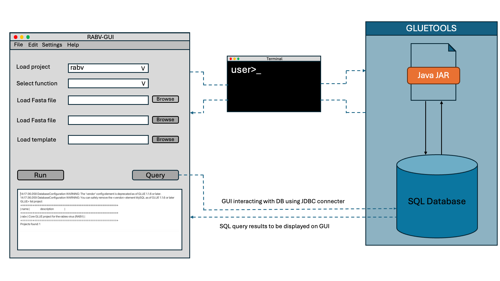

# Summary

Genetic sequencing has become an essential tool for viral pathogen surveillance, yet many bioinformatics tools and resources remain focused on pandemic or high-threat viruses. Furthermore, these resources often lack usability and up-to-date, context-specific information for other pathogens. Most available tools are command-line based, making them difficult to install and use, especially for users who may not have advanced computational skills. Rabies virus (RABV), an endemic zoonotic virus, has amassed a substantial dataset of publicly available sequences despite being considered a low-priority/neglected pathogen. However, the ability to fully leverage this data is limited, reflecting the broader challenges of applying cutting-edge sequencing technologies to neglected pathogens, where infrastructure, resources, and tools are often underdeveloped.   To address this issue, RABV-GUI was developed, providing an intuitive interface to access up-to-date, curated RABV sequence datasets and multiple functions to assist users in analysing and interpreting the data. Features include a query tab that allows users to easily retrieve customised datasets of sequences and corresponding metadata through a range of filter options,  a streamlined process to aid the submission of genome sequences to GenBank, and additional sequence annotation for lineage-level classification. The RABV-GUI database includes over 29,500 curated RABV sequences and their associated metadata from NCBI GenBank, standardised by the tool, and is designed for quarterly updates to keep pace with new RABV submissions. This cross-platform GUI tool serves as a user-friendly alternative to command-based tools, making it accessible for non-computational researchers to perform RABV sequence related analysis. 

# Statement of need

Rabies is a neglected zoonotic disease found in over 150 countries, mainly affecting low and middle-income countries in Asia and Africa (Jane Ling et al., 2023). Globally, dog-mediated rabies is responsible for over 59,000 deaths annually (Hampson et al., 2015), with a nearly 100% mortality rate once symptoms become obvious. Despite the high mortality rate and advancements in sequencing capacity (Jaswant et al., 2024) , there are still limited genomic tools tailored specifically for rabies virus (RABV) sequence analysis. While generic bioinformatic tools such as Gluetools (Singer et al., 2018), table2asn (Sayers et al., 2023), Prokka (Seemann, 2014), VIGOR (Wang et al., 2012) can be adapted for RABV sequence analysis and annotation,  many require users to create and provide custom sequence databases. Creation of such databases and use of the tools themselves demands bioinformatics skills that most end-users lack. Additionally, compiling a well-curated, clean database of publicly available RABV (or any virus) sequences and metadata from sources like NCBI GenBank demands significant time and effort.  To address these challenges, RABV-GUI was developed as an easy-to-use cross-platform interface that provides easy access to an updated database of over 29,500 RABV sequences and associated metadata from NCBI GenBank. This database has been standardised and enriched with additional genetic classification from the published RABV lineage assignment tool, MADDOG (Campbell et al., 2022), making it a vital resource for researchers requiring quick and reliable access to RABV sequence data. RABV-GUI also includes user-friendly query functions, allowing users to filter and customise datasets by parameters such as sequence length, gene, clade, or country, making it adaptable to various research needs. Additionally, it simplifies the GenBank submission process, enabling users to generate submission files with just a few clicks, taking mundane, labour-intensive tasks out of the hands of researchers and streamlining genomic research workflows. By combining curated data access with streamlined GenBank submission, RABV-GUI represents a significant resource for the rabies research community, facilitating the comparison of sequences across regions and aiding in virus tracking efforts.

# Implementation

The software is developed in IntelliJ IDEA 2024.1.4 (Community Edition) and its GUI is designed using Scene Builder. The working principle of the tool is straightforward. The GUI interacts with Gluetools in the backend to perform GenBank submission and maxLikelihoodGenotyper to assign the alignment/clade to a given sequence. The GUI directly interacts with gluetools SQL database using a Java Database Connectivity (JDBC) connection for the database query and fetching the meta information. The detailed working of the GUI is illustrated in Figure 1. The database will be updated quarterly, with each release version named according to the database creation date. The test data for GenBank submission is downloaded from NCBI  nucleotide with accession number PP858775 and  PP858776.

# Results and discussion

The RABV-GUI is a standalone, cross-platform application specifically designed for RABV sequence analysis. The tool is equipped with two primary functions: i) gbSubmission to generate GenBank submission (*.SQN) files from the given sequences. This function requires a set of FASTA sequences, metadata information and a Genbank template file (*.sbt) from the user in order to create the GenBank submission SQN files. ii) The maxLikelihoodGenotyper function assigns the alignment/clade to a given sequence. Both these functions are supported by Gluetools, which the GUI executes in the background. Apart from the primary functionality, the GUI is updated with the new RABV sequence database facilitating better sequence annotation for user-submitted sequences in relation to their related phylogenetic clades and lineages. The database used in the GUI consists of more than 29,500 RABV sequences and their metadata enabling selection of appropriate annotation features from the closest reference alignment during the GenBank sequencing submission process. The database also consists of lineage information adapted from MADDOG which is essential for classifying rabies virus lineages using a published, standardised nomenclature system and increases the resolution of phylogenetic classifications from minor clade to a more detailed level. Additionally, the tool also provides a query panel which can be used to obtain useful information on numbers of sequences available in the database in total or by filter query to obtain specific sequence information according to user’s needs. This includes queries based on the  length of the genome, global region, country, host, NCBI submission date and ten other parameters. 

# Competing interests  

All the authors declare that they have no competing interests

# Acknowledgements

This work was supported by UK Medical Research Council funding awarded to KB [MR/X002047/1]

# References
